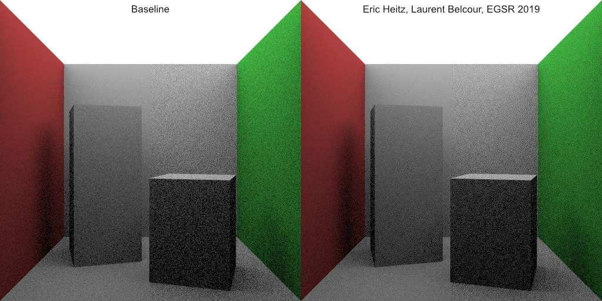

## PT with PMJ

## How to run

```
git clone https://github.com/Ushio/ProgressiveMultiJitteredSampleSequences.git
git submodule update --init
```

## PMJ vs Random
64 spp


## [option] experiment "Distributing Monte Carlo Errors as a Blue Noise in Screen Space by Permuting Pixel Seeds Between Frames"

```
#define ENABLE_HEITZ 1
```

64 spp




## references 
Per Christensen, Andrew Kensler, Charlie Kilpatrick, "Progressive Multi-Jittered Sample Sequences"

SIGGRAPH University 2019 Course - My Favorite Samples ( https://www.youtube.com/watch?v=bHDfETTS550 )

Eric Heitz and Laurent Belcour, "Distributing Monte Carlo Errors as a Blue Noise in Screen Space by Permuting Pixel Seeds Between Frames"